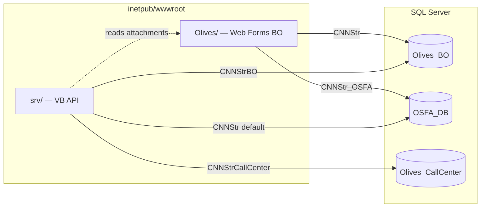

# IIS Web.config & SQL connection extraction notes

Investigation date: 2026-08-13. Sources: `/media/alaa/data/olives/apps/client-chatbot/olives web pages/` (primary) and cross-check against `/media/alaa/data/olives/olives web pages/` (identical 901 MB tree; `diff -rq` found no file differences).

> **SECURITY WARNING:** Web.config files in this tree contain live database credentials (SQL logins and passwords). This note redacts passwords as `PASSWORD_REDACTED`. Do not commit, paste, or log the raw Web.config values. Rotate credentials if this tree has been shared broadly.

---

## 1. IIS folder layout vs typical `inetpub\wwwroot`

Customer deployments use **two sibling IIS applications** under `C:\inetpub\wwwroot\`:

| IIS app path (typical) | Repo mirror | Role |
|------------------------|-------------|------|
| `C:\inetpub\wwwroot\Olives\` | `olives web pages/Olives/` | Back-office Web Forms UI (reports, orders, promotions, dashboards) |
| `C:\inetpub\wwwroot\srv\` | `olives web pages/srv/` | Field-sales / mobile HTTP API (`Services/General.aspx` opcode dispatcher) |

Evidence for the Olives path on disk:

```18:18:/media/alaa/data/olives/apps/client-chatbot/olives web pages/srv/Web.config
    <add key="SalesOrderAttachmentsPath" value="C:\inetpub\wwwroot\Olives\Attachments\SalesOrderAttachments\"/>
```

### Olives site structure (high level)

| Path under `Olives/` | Contents |
|----------------------|----------|
| `Web.config` | Connection strings, DevExpress, forms auth, app settings |
| `bin/Olives_BO.dll` (~19 MB) | **All C# code-behind, data access, reports logic** (no `.cs` sources in deploy tree) |
| `bin/` | DevExpress v15.2, ClosedXML, ReportViewer, Newtonsoft.Json, etc. |
| `Pages/` | ~hundreds of `.aspx` markup pages (DevExpress grids, reports) |
| `Login_Page.aspx` | **Active** login UI (not `Account/Login.aspx`) |
| `Master.Master` | Shell layout; injects `Session[...]` into JS |
| `Reports/Data/*.xss` | Typed DataSet designer layouts (report table names only; connection wired in DLL) |
| `assets/js/` | Page-specific AJAX (dashboards, notifications, route assignment) |
| `Account/` | Legacy ASP.NET membership templates (`Login.aspx`, `Register.aspx`) + `Web.config` that denies anonymous users |
| `Global.asax` | Points to `Olives_BO.Global` in DLL |

**Not present in deploy tree:** `App_Code/`, `.aspx.cs` code-behind files, `PrecompiledApp.config` (Olives is deployed as compiled DLLs in `bin/`, not as updatable precompiled pages).

### srv site structure

| Path under `srv/` | Contents |
|-------------------|----------|
| `Web.config` | Three connection strings + `CompNo` app setting |
| `PrecompiledApp.config` | `updatable="true"` — markup editable, logic in `Bin/` |
| `Bin/App_Code.dll` | `GeneralMethods` class (shared DB/business layer for mobile) |
| `Bin/App_Web_*.dll` | Precompiled page assemblies |
| `Services/General.aspx` | Main API entry (`?op=<opcode>&CompNo=...&salesmanno=...`) |
| `Services/GetImage.aspx` | Image upload/download helper |
| `Services/Default.aspx` | Secondary service page |

---

## 2. Web.config inventory (all copies in repo)

Six `Web.config` files exist (root copy and client-chatbot copy are duplicates):

| File | Purpose |
|------|---------|
| `Olives/Web.config` | Primary BO app — **Olives_BO** + **OSFA_DB** |
| `Olives/Account/Web.config` | Denies unauthenticated access to `Account/*` except `Register.aspx` |
| `srv/Web.config` | Mobile API — **OSFA_DB**, **Olives_BO**, **Olives_CallCenter** |

No other `Web.config` variants were found elsewhere in the olives repo.

---

## 3. Connection string fields (passwords redacted)

**Provider (all):** `System.Data.SqlClient`

### 3.1 `Olives/Web.config`

| Name | Data Source | Initial Catalog | Auth | Other fields |
|------|-------------|-----------------|------|--------------|
| `ApplicationServices` | `10.0.10.105\SQLEXPRESS` | `aspnetdb.mdf` (attached, `\|DataDirectory\|`) | **Windows integrated** (`Integrated Security=SSPI`, User Instance) | Legacy ASP.NET membership DB — likely unused in practice |
| `CNNStr` | `10.0.10.105` | `Olives_BO` | **SQL login** `cds` / `PASSWORD_REDACTED` | `Connection Timeout=600`; `MultipleActiveResultSets=true` |
| `CNNStr_OSFA` | `10.0.10.105` | `OSFA_DB` | **SQL login** `cds` / `PASSWORD_REDACTED` | `MultipleActiveResultSets=true` |

**Notable `appSettings`:**

| Key | Value | Relevance |
|-----|-------|-----------|
| `EnableCompanySelection` | `true` | Multi-company login dropdown |
| `SqlVersion` | `2008` | App expects SQL Server 2008+ semantics |
| `SqlTimeout` | `3000` | Command timeout (seconds) |
| `ConnectionTimeOut` | `1200` | Connection timeout |
| `ChartImageHandler` | `storage=file;dir=c:\TempImageFiles\` | Chart rendering on server filesystem |

**Auth / session:**

- `authentication mode="Forms"` with `loginUrl="~/Account/Login.aspx"` — but the live login page is `Login_Page.aspx` at site root.
- `sessionState timeout="2880"` (48 hours).

**Password handling:** The `cds` password in this customer's Olives `Web.config` appears **obfuscated/encrypted** (base64-like value). `Olives_BO.dll` exposes `get_ConStr`, `get_ConStr_OSFA`, `EncConStr_OSFA`, and `DecryptCodeInBO` — the app likely decrypts before opening `SqlConnection`.

### 3.2 `srv/Web.config`

| Name | Data Source | Initial Catalog | Auth | Other fields |
|------|-------------|-----------------|------|--------------|
| `CNNStr` | `.` (local default instance) | `OSFA_DB` | **SQL login** `cds` / `PASSWORD_REDACTED` | `Connect Timeout=500` — **default connection** for `GeneralMethods` |
| `CNNStrBO` | `.` | `Olives_BO` | **SQL login** `cds` / `PASSWORD_REDACTED` | `Connect Timeout=500` |
| `CNNStrCallCenter` | `.` | `Olives_CallCenter` | **SQL login** `cds` / `PASSWORD_REDACTED` | `Connect Timeout=500` |

**App settings:** `CompNo=0` (fallback company when request omits `CompNo`), `UseXAF=1`, attachment paths under `C:\inetpub\wwwroot\Olives\`.

**Deploy note:** Olives and srv Web.configs on the **same customer** can point at **different hosts** (`10.0.10.105` vs `.`) and use **different password encodings** (encrypted vs plaintext). Per-customer values always win — do not assume one template.

### 3.3 Multiple databases summary

| Database | Olives site | srv site | Typical use |
|----------|-------------|----------|-------------|
| `Olives_BO` | `CNNStr` | `CNNStrBO` | Back-office ERP data (orders, customers, reports) — **chatbot target** |
| `OSFA_DB` | `CNNStr_OSFA` | `CNNStr` (primary) | Field force / mobile transactional DB |
| `Olives_CallCenter` | — | `CNNStrCallCenter` | Call-center features |
| `aspnetdb.mdf` | `ApplicationServices` | — | Legacy membership (integrated auth) |

---

## 4. How pages query SQL (no source, inferred from deploy artifacts)

### 4.1 Olives back-office (`Olives_BO.dll`)

- Every `.aspx` declares `CodeBehind="*.aspx.cs"` and `Inherits="Olives_BO...."`, but **only the compiled DLL exists** — all ADO.NET / stored-proc calls live in `bin/Olives_BO.dll`.
- Data layer naming in DLL: `Olives_BO.DA` / `DD` / `BF` (data adapters, typed datasets, business facades).
- Reports: `Olives_BO.Reports.Data` typed datasets; `Reports/Data/*.xss` lists hundreds of report table adapters (e.g. `Rpt_OSFANewCustomers`, `Rpt_SalesmanActivity`). Runtime connection is resolved inside the DLL (almost certainly `ConfigurationManager.ConnectionStrings["CNNStr"]` or `get_ConStr` with decryption).
- UI pattern: DevExpress `ASPxGridView` controls bind to typed datasets / ObjectDataSource in code-behind; `CompanyID` is a hidden key column on virtually every grid.
- AJAX pattern (client-side): jQuery `$.ajax` POST to **same page** WebMethods, e.g. `SalesmanDashboardNew_Page.aspx/GetDashboardData` — session/authentication handled by ASP.NET; company scope comes from server session, not from JS.

### 4.2 srv mobile API (`App_Code.dll` + `General.aspx.vb`)

The one readable source file confirms the connection pattern:

```1306:1318:/media/alaa/data/olives/apps/client-chatbot/olives web pages/srv/Services/General.aspx.vb
    Public myConnection As New SqlClient.SqlConnection(GetConnectionString())
    Private Function GetConnectionString() As String
        Dim ConStr As String = System.Configuration.ConfigurationManager.ConnectionStrings("CNNStr").ConnectionString
        Return ConStr
    End Function
    Public Sub DBConn()
        ...
        myConnection.ConnectionString = GetConnectionString()
        myConnection.Open()
```

`GeneralMethods` (in `Bin/App_Code.dll`) also exposes `GetConnectionStringBO`, `CloseConn`, `CloseConnBO`, and CallCenter helpers — srv routinely talks to **both** OSFA and Olives_BO within one request.

`General.aspx` `Page_Load` routing:

- Reads `CompNo` → `GM.gCompNo` (company/tenant for the request).
- Reads `salesmanno` → `GM.SalesmanNo`.
- Reads `op` → dispatches hundreds of opcodes to `GM.*` methods (mostly **read/write** field operations).
- Rejects `gCompNo = 0` for most ops (logs `"Company ID Is 0"`).

This is **not** a read-only reporting API — it is the mobile sync/write surface.

---

## 5. Login, session, and CompanyID / tenant scoping

### 5.1 Login flow (`Login_Page.aspx`)

- User enters username → `CompanyList` combo populated via DevExpress callback (`CompanyList_Callback` in DLL).
- `EnableCompanySelection=true` allows picking among companies the user can access.
- On prior visit, `document.cookie` key **`CompanyID`** pre-selects the company in the combo.
- Login button: `LoginBtn_Click` in DLL — sets session and auth cookie.
- Language combo (English / Arabic) stored in session.

### 5.2 Session keys used in markup

From `Master.Master` and related JS:

| Session key | Where used |
|-------------|------------|
| `UserName` | Navbar user menu |
| `CompanyName` | Footer |
| `JsonListMenu` | Injected as `jsonListMenu` for `Menu.js` |
| `Lang` | UI locale |
| `IsFirstLoad` | First-load behavior flag |

DLL also references `InsertToSession`, `ClearSession`, `GetEnableCompanySelection`, `get_gCompanyID` — company ID is stored server-side after login.

### 5.3 Data-level tenant column

- Canonical column: **`CompanyID`** (`smallint`/`int` — varies by table) on virtually all BO tables.
- Composite keys everywhere: `CompanyID;OrderYear;OrderNo;...`, `CompanyID;CustomerID;...`, etc.
- srv mobile API uses request parameter **`CompNo`** (same semantic as `CompanyID`).
- No `SESSION_CONTEXT` / row-level security in the legacy app — scoping is **application-enforced** (session + proc parameters).

### 5.4 Chatbot tenant wall (for comparison)

The pilot chatbot (`apps/client-chatbot/core/sql.py`, `db/02_tenant_views.sql`) uses a **different, safer pattern**:

- Login: `chatbot_ro` (read-only server login).
- Before each query: `EXEC sp_set_session_context N'CompanyID', @id`.
- Queries hit `t.<Table>` views that filter `WHERE CompanyID = CONVERT(int, SESSION_CONTEXT(N'CompanyID'))`.
- Fail-closed: unset context → zero rows.

---

## 6. srv vs Olives — relationship



- **Olives** = human back-office users (browser, forms auth, DevExpress).
- **srv** = mobile/handheld clients (opcode `General.aspx`, JSON/text responses, `cds` SQL login).
- They share the **`cds` SQL principal** and overlapping databases but are separate IIS apps with **separate Web.config** files.
- srv attachment paths point into the Olives site's `Attachments\` folder.

---

## 7. Existing chatbot / widget JS

**None found.** Grep across `olives web pages/` for `chatbot`, `ChatBot`, `intercom`, `crisp`, `tawk` returned only unrelated jQuery UI / bootstrap “widget” plugin code. There is no embedded Olives chatbot widget to reuse.

The standalone chatbot lives separately at `apps/client-chatbot/` (Python FastAPI + `chatbot_ro`).

---

## 8. Implications for a chatbot widget on the Olives site

### Same server, same DB?

| Aspect | Legacy Olives site | Recommended chatbot widget |
|--------|-------------------|---------------------------|
| SQL host | Customer `Data Source` from `Olives/Web.config` → `CNNStr` | **Same host** (read from customer config at deploy time) |
| Database | `Olives_BO` (`Initial Catalog`) | **Same database** |
| SQL login | `cds` (read/write, often decrypt-at-runtime) | **`chatbot_ro`** (read-only, provisioned per `db/01_readonly_login.sql`) |
| Tenant scope | ASP.NET `Session` + `CompanyID` column in procs | `sp_set_session_context('CompanyID', …)` + `t.` views |
| Query path | Stored procs via `Olives_BO` DA/BF | Allow-listed procs + gated SQL via `core/sql.py` |

### Should the widget use the site's `cds` credentials?

**No.** Reasons:

1. `cds` is the application's full-privilege login (read/write, EXEC on business procs).
2. Password may be encrypted in Olives config; decrypt logic is inside `Olives_BO.dll`, not suitable for a Python/JS widget.
3. Browser-exposed widget must not carry SQL credentials at all.
4. The chatbot pilot already defines `chatbot_ro` + tenant views — reuse that wall.

### Practical embedding pattern

1. **Widget JS** in `Master.Master` (or a single user control) — floating chat UI, calls **chatbot HTTP API** (`/ask` on port 8100 or reverse-proxied under IIS).
2. **Auth bridge:** pass `CompanyID` + user identity from ASP.NET session to the chatbot API via a short-lived server-signed token (not implemented in tree today — open question).
3. **Config on IIS box:** chatbot service `.env` with `DB_HOST` / `DB_PORT` matching customer SQL Server; `clients/<name>.yaml` with `db_name` = restored or live `Olives_BO` catalog name.
4. **Do not** proxy through `srv/Services/General.aspx` — wrong auth model, write-capable, opcode-specific.

### Read-only vs site credentials

| Approach | Verdict |
|----------|---------|
| Reuse `CNNStr` / `cds` from Web.config | **Reject** — write-capable, secret exposure risk |
| New `chatbot_ro` on same instance + `t.` views | **Accept** — matches `apps/client-chatbot` pilot |
| Windows integrated auth (like `ApplicationServices`) | **Not used** for business data in this deploy |

---

## 9. What to copy vs reference for standalone chatbot

### Needed at runtime (chatbot service)

| Artifact | Needed? | Notes |
|----------|---------|-------|
| `apps/client-chatbot/core/`, `api/`, `db/` | **Yes** | Actual chatbot |
| `clients/<customer>.yaml` | **Yes** | Per-customer DB name, aliases |
| `.env` (`DB_HOST`, `DB_PORT`, API tokens) | **Yes** | Host/port from customer `CNNStr` **Data Source** only |
| `work/ro_password.txt` | **Yes** | Generated by `setup/03_apply_db_sql.py` |

### Reference only (do not bundle into chatbot)

| Artifact | Why reference |
|----------|---------------|
| `Olives/Web.config` | Host, catalog names, timeout hints — **never ship passwords** |
| `Olives/bin/Olives_BO.dll` | Proc/table behavior — use vault (`obsidian/olives/Olives_BO/`) instead |
| `Olives/Pages/*.aspx` | UI/report inventory; code-behind not present |
| `srv/` entire tree | Mobile write API — different product surface |
| `Olives/assets/**` | Static theme — only if matching visual style in widget |
| DevExpress / ReportViewer DLLs | Not needed for chatbot |

### Useful reference for widget integration

| File | Insight |
|------|---------|
| `Olives/Login_Page.aspx` | Company selection UX, `CompanyID` cookie |
| `Olives/Master.Master` | Session variables available after login |
| `Olives/assets/js/SalesmanDashboard.js` | Example of same-page WebMethod AJAX |
| `obsidian/olives/Olives_BO/procedures/*.md` | Stored proc catalog (chatbot brain) |

---

## 10. Open questions for humans

1. **Per-customer SQL host:** Olives `Web.config` shows `10.0.10.105` while srv shows `.` — are these always the same machine in production, or can srv and Olives diverge?
2. **Password encryption:** What algorithm/key does `DecryptCodeInBO` / `get_ConStr` use? Needed only if someone insists on reading `CNNStr` programmatically (chatbot should not).
3. **Login page mismatch:** `Web.config` forms `loginUrl` is `~/Account/Login.aspx` but production uses `Login_Page.aspx` — is URL rewrite in play, or stale config?
4. **Auth bridge:** How should the embedded widget obtain a trusted `CompanyID` + user role — ASP.NET session cookie, JWT minted by a small C# endpoint, or separate chatbot login?
5. **`cds` vs `chatbot_ro` on customer SQL Server:** Will customers allow creating `chatbot_ro` + `t.` views on production, or only on a restored copy?
6. **Multi-company users:** When `EnableCompanySelection=true`, can one user switch companies mid-session without re-login? Widget must match that behavior.
7. **OSFA_DB scope:** Does the chatbot ever need `CNNStr_OSFA` data, or is `Olives_BO` sufficient for pilot reports?
8. **`ApplicationServices` / membership:** Is ASP.NET membership still active, or is auth entirely custom in `Olives_BO` login tables?
9. **IIS reverse proxy:** Will the chatbot API run on the same Windows box (localhost) or a Linux container reachable from IIS?
10. **Report parity:** Many reports flow through `ReportsViewer_Page.aspx?ID=<n>` — should the chatbot duplicate those report IDs or only ad-hoc SQL/procs?

---

## 11. Quick reference — connection string name map

```
Olives site (C# / Olives_BO.dll):
  CNNStr       → Olives_BO     (primary BO)
  CNNStr_OSFA  → OSFA_DB       (cross-DB features)

srv site (VB / GeneralMethods):
  CNNStr           → OSFA_DB           (default GetConnectionString)
  CNNStrBO         → Olives_BO         (GetConnectionStringBO)
  CNNStrCallCenter → Olives_CallCenter

Chatbot pilot (Python / pymssql):
  env DB_HOST + DB_PORT → same server as customer CNNStr Data Source
  user chatbot_ro       → Olives_BO only, SELECT on t.* views
  set_tenant(company_id) → SESSION_CONTEXT('CompanyID')
```
