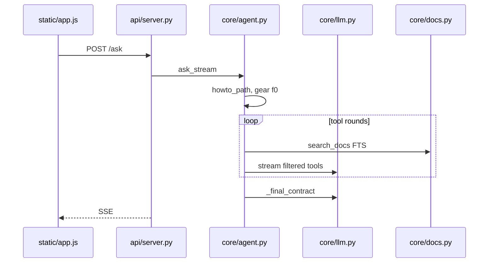
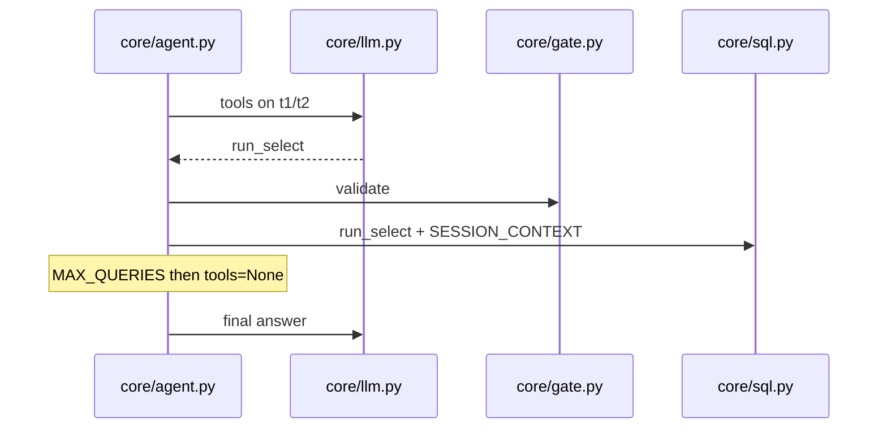
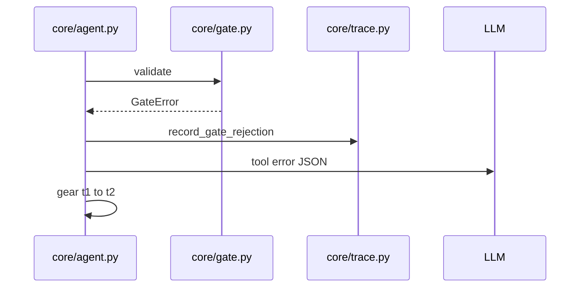
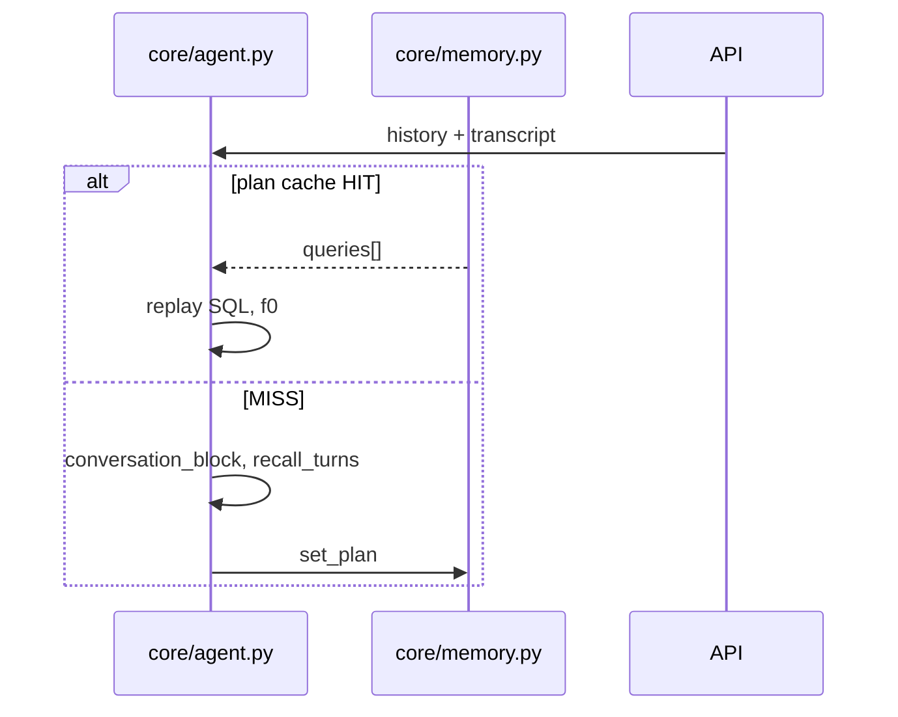

# Phase 1 — End-to-end architecture & control flow (read-only)

**Lens:** llm-evaluation — runtime design, measurability, regression policy.  
**Status:** Static analysis; live behavior *not verified* unless noted.

See also: [index](./llm-evaluation-audit-index.md) · Phase 2 · Phase 3.

---

## 1. Request lifecycle

### Startup / tenant pinning

`CHATBOT_CLIENT` is validated at import; the browser cannot switch tenants (`AskRequest.client` ignored).

```59:68:api/server.py
def pinned_client() -> str:
    name = os.environ.get("CHATBOT_CLIENT")
    ...
PINNED_CLIENT = pinned_client()
```

### Browser → API

- `static/app.js`: `session_id` in `sessionStorage`, `X-Session-Id`, `GET /context`, `POST /context` on company change.
- Company switch clears `history` and `transcript` (`_set_session_company` in `api/server.py`).

### POST `/ask`

1. Rate limit 30/min per session.
2. `_touch_session` → optional `work/sessions.sqlite` load; `_ensure_session_company`.
3. `subject` = SHA-256(session_id)[:12] for traces / DeepSeek `user_id` hashing.
4. `agent.ask_stream(...)` on background thread; SSE: `step`, `answer_chunk`, final JSON, `[DONE]`.
5. Disconnect → `TurnCancelled`.
6. `record_session_turn` → history (4 turns), transcript (100); `_persist_session`.

### Agent (`core/agent.py` `ask_stream`)

1. Load schema cache, catalog, profile; pin `CompanyID`.
2. Calendar guard before plan cache (`_empty_calendar_needs_ask`).
3. Plan cache hit → re-run SQL, single LLM turn, no tools, gear `f0`.
4. Else build messages: stable prefix + dynamic blocks + user question.
5. Loop ≤ `MAX_TURNS`: `_active_tools` → `_stream_turn` → `_run_tool`.
6. `_build_envelope`, `memory.set_plan`, trace + latency.

### SQL path

`run_select` / metrics / reports → `gate.validate` → `set_tenant` → `t.*` views.

### Feedback

`POST /feedback`: thumbs-up re-runs `gate.validate` before `promote_verified_query`.

---

## 2. Sequence diagrams

### (a) Docs-only



### (b) NL2SQL success



### (c) Gate rejection



### (d) Multi-turn memory/cache



---

## 3. Decision points

| Decision | Mechanism |
|----------|-----------|
| Docs vs SQL vs report | `_is_howto_path`, `_is_report_path`, `_is_fast_count_path`, visit/analysis regexes |
| Initial gear | `f0` howto/report/fast_count; `t2` analysis; else `t1` |
| Escalation | Tool error → `t1`→`t2` |
| Rescue | Gear `p` only `_retry_empty_final` |
| Tool off | `MAX_QUERIES`, path subsets, doc/vault caps, `docs_only` |
| Company | UI dropdown; block company `ask_user` |
| Plan cache | Skip honesty/relative-date; calendar before replay |

---

## 4. Data boundaries

- **Never to model as authority:** base tables, proc bodies, credentials, uncapped rows.
- **In context:** schema, playbook, vault cards, FTS chunks, tool JSON (≤50 rows display cap in tool payload; 200 execute cap).
- **Caches:** plan exact-match; result 45s TTL.

---

## 5. Failure modes

| Failure | User | Logged |
|---------|------|--------|
| Provider | Arabic unavailable message | — |
| Other exception | Generic Arabic | — |
| GateError | Via model loop | gate counter, trace |
| needs_ask | SSE text | trace |
| Disconnect | Stop | TurnCancelled |
| No evidence | English refusal | refused |

---

## 6. Planned vs wired

| Item | State |
|------|--------|
| Widget | Not built |
| Vault MCP stdio | Not runtime; `core/vault.py` in-process |
| EXEC | Blocked (`allowed_proc_names=[]`) |
| run_report SELECT | Wired |
| Lab `/db/connect` | Wired; dbo fallback risk |
