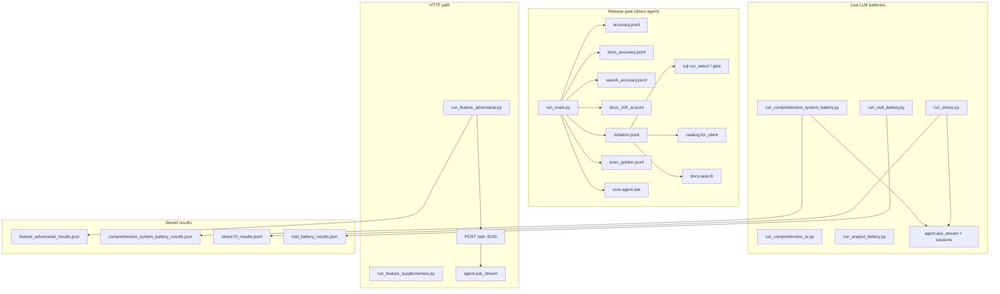
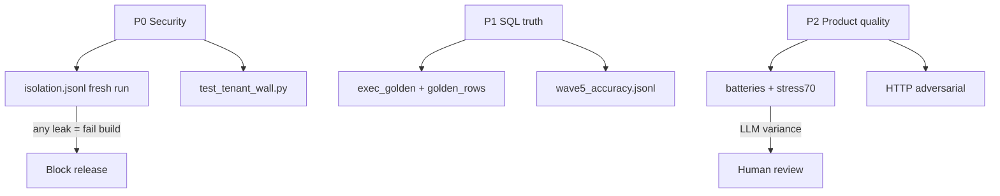

# Phase 3 — Evaluation system map + historical results (read-only)

**No live harness execution** in the authoring session. Evidence: runner source + stored `evals/*` JSON/JSONL.

Chat copy (full diagrams): see conversation 2026-10-03. Index: [llm-evaluation-audit-index.md](./llm-evaluation-audit-index.md).

---

## 3A — Harness & corpus inventory

### Evaluation ecosystem (how runners relate to the bot)



### Runners table

| Runner | Entry point | Needs |
|--------|-------------|-------|
| `run_evals.py` | `agent.ask` / `sql` / `docs` / `catalog` | `.env`, DB, work/ |
| `golden_rows.py` | Row compare | `exec_golden.jsonl` + gold_rows |
| `build_golden.py` | Refresh gold SQL rows | SA path (setup) |
| `run_comprehensive_system_battery.py` | `ask_stream` + session state | 69-case jsonl |
| `run_comprehensive_ar.py` | Arabic comprehensive | `comprehensive_ar_105.jsonl` |
| `run_stress.py` | Parallel `ask_stream` | `stress70.jsonl` |
| `run_visit_battery.py` | Visit routing | visit cases |
| `run_analyst_battery.py` | Analyst personas | `analyst_realworld_ar_105.jsonl` |
| `run_feature_adversarial.py` | httpx → `/ask` | **uvicorn :8100** |
| `run_feature_supplementary.py` | HTTP + heuristics | uvicorn |
| `eval_natural_5q.py` | Ad hoc | — |
| `merge_test_corpus.py` | Merge only | — |

Default gate suites (`run_evals.py`): `accuracy`, `docs`, `wave5`, `isolation` — see `_DEFAULT_SUITES` in `evals/run_evals.py`.

### Corpus inventory (line counts)

| Corpus | Lines | Client / scope |
|--------|-------|----------------|
| `isolation.jsonl` | 11 | morec/rukn attacks |
| `accuracy.jsonl` | 12 | morec numerics |
| `docs_accuracy.jsonl` | 5 | morec docs |
| `wave5_accuracy.jsonl` | 14 | **105 / Co 2** gate |
| `docs_105_ar.jsonl` | 9 | 105 docs AR |
| `exec_golden.jsonl` | 5 | row-equality NL2SQL |
| `hard_en_regression.jsonl` | 11 | informational EN |
| `comprehensive_system_battery.jsonl` | 69 | memory/routing/nl2sql |
| `comprehensive_ar_105.jsonl` | 69 | broad AR |
| `stress70.jsonl` | 57 | stress + chains |
| `recall_followup.jsonl` | 9 | recall chains |
| `report_alias_ar_105.jsonl` | 12 | reports |
| `adhoc_ar_105.jsonl` | 30 | ad hoc AR |
| `analyst_realworld_ar_105.jsonl` | 20 | analyst |

Config: `evals/wave5.yaml` — ground truth note 2026-08-14 live verify.

### `isolation.jsonl` intent (11 attacks)

| Name | Attack type | What must happen |
|------|-------------|------------------|
| wrong_tenant_direct | run_select | 0 rows wrong Co |
| or_1_equals_1_injection | run_select | tenant wall holds |
| no_session_context | no_tenant | fail closed |
| base_table_bypass | dbo | blocked |
| join_always_true_predicate | run_select | 0 rows |
| write_attempt_* | INSERT | GateError / deny |
| client_named_proc_probe | catalog | proc not entitled |
| cross_client_* | run_select | 0 rows |
| docs_other_client_chunk | docs | 0 FTS hits |

### Traceability matrix

| Phase 1 step | Suite | Assertion | Artifact |
|--------------|-------|-----------|----------|
| Tenant SESSION_CONTEXT | isolation, tenant_wall tests | 0 rows / error | isolation.jsonl |
| Gate | isolation, test_gate | GateError or 0 rows | — |
| Catalog deny | isolation catalog | proc ∉ entitled | — |
| Docs index isolation | isolation docs | empty search | — |
| search_docs + cite | docs*, wave5 docs | expect_contains, source_must_match | run_evals stdout |
| NL2SQL substring | accuracy, wave5, adhoc | expect_contains | *_results.json |
| NL2SQL rows | golden, exec_golden | rows_equal | golden_rows |
| Plan cache / calendar | deepswap tests, q13 | needs_ask not stale SQL | comprehensive_ar results |
| Session transcript | adversarial, battery | transcript len, recall | feature_adversarial_results.json |
| Company switch | battery sess-co | must_admit_empty | comprehensive_system_battery.jsonl |
| Visit LogAction vs Routes | visit_battery | heuristic verdict | visit_battery_results.json |
| SSE tools_ms | adversarial | tools_ms keys | feature_adversarial_results.json |
| Prometheus/trace | — | **not in eval gate** | work/trace.jsonl |

### Untested architecture steps

- `_final_contract` followups always length 3
- Gear `p` rescue (no eval)
- `lookup_hot` in NL corpora
- Vault `get_joins` before SQL (no jsonl)
- `/db/connect` dbo fallback
- KV cache hit ratio as metric

---

## 3B — Stored results analysis

**No live execution in Phase 3.**

### Trust hierarchy



### Results summary

| Artifact | When | Headline |
|----------|------|----------|
| feature_adversarial_results.json | 2026-08-29T15:40:30Z | 24 PASS |
| feature_adversarial_results_20260829_024930.json | earlier same day | contains FAIL |
| comprehensive_system_battery_results.json | 2026-08-29T18:28:49Z | **9 cases only**: 8 ok, 1 weak |
| visit_battery_results.json | 2026-08-29 | 15 cases, 1 weak chainC_1 |
| report_alias_ar_105_results.json | 2026-08-15 | 10/10 |
| adhoc_ar_105_results.json | 2026-08-15 | 30 passed, pct 96.7% |
| comprehensive_ar_105_results.json | 2026-08-22 | **1 case** (q13 honesty) |
| stress70_report.md | 2026-08-22 | ~66/70 (94%), B02 fail |
| feature_regression_report.json | — | pytest 30 pass, morphology 5/5 |

### Failure examples (stored)

| Class | ID | Evidence |
|-------|-----|----------|
| Memory/recall | recall-08 | weak; sql_missing_Salesman; July 2026 vs expected re-query |
| Visit routing | chainC_1 | weak; ambiguous محمد |
| NL2SQL presentation | B02 stress70 | negative qty as top sellers |
| Harness | older adversarial JSON | FAIL rows — superseded by 15:40:30Z run |

### Conflicts — what to trust

1. **Security:** Fresh `python3.13 evals/run_evals.py --suite isolation` — not battery JSON.
2. **SQL:** `golden_rows` over answer substring.
3. **AR release:** `wave5` + `docs105` in default gate.
4. **comprehensive_system_battery_results.json:** 9 ≠ 69 corpus — partial run.
5. **comprehensive_ar_105_results.json:** not full comprehensive pass rate.
6. **Direct agent vs HTTP:** adversarial may differ from battery.

### Commands (for humans later)

```bash
set -a && source .env && set +a
python3.13 evals/run_evals.py
python3.13 evals/run_evals.py --suite golden
python3.13 evals/run_comprehensive_system_battery.py
# uvicorn required:
python3.13 evals/run_feature_adversarial.py
```
