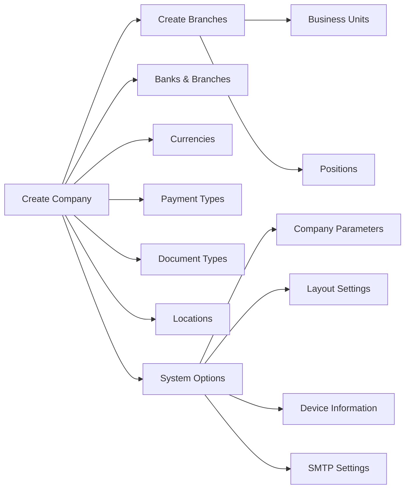

# Company & System Setup Workflow

## Overview
Initial system configuration: define the company, branches, business units, financial infrastructure (banks, currencies, payment types), and system-wide parameters. All other workflows depend on this foundation.

## Step-by-Step

### Phase 1: Core Company
1. **[[Companies]]** — Create company record:
   - Company Name, Logo (JPG format), Address
   - Multi-company supported: same server can host multiple companies
   - Each company has its own criteria, customization, and user privileges

2. **[[CompanyBranches]]** — Define branches per company:
   - Critical for user permission segregation (see [[Users-and-Permissions]])
   - Links to `UserCompanyBranchLink`

### Phase 2: Business Structure
3. **[[BusinessUnits]]** — Define "business time":
   - Ties salesperson, route, customer, and day-of-week together
   - Per-branch configuration
   
4. **[[Positions]]** — Define positions:
   - **Critical concept**: a "basket of privileges" attached to a role, not a person
   - If Salesman A resigns → change name on position → new salesman inherits all privileges
   - Separates identity (who) from role (what they can do)

### Phase 3: Financial Infrastructure
5. **[[Banks]] + `BanksBranches`** — Define banks and branches for check processing
6. **[[Currencies]]** — Define currencies + fractions + conversion rate to local currency
7. **`CurrenciesConvertRate`** — Track fluctuating exchange rates over time
8. **`PaymentTypes`** — Define payment methods (Cash, Due Checks, Postponed Checks, etc.)
9. **`DocumentTypes`** — Define transaction types for ERP integration mapping

### Phase 4: System Configuration
10. **[[Locations]]** — Define geographic hierarchy (city → avenue → street)
11. **`NoTransactionReason`** — Define reasons a salesman couldn't complete a transaction
12. **[[ImageTypes]]** — Define photo categories (Registration Certificate, ID, Store Front)
13. **`DeviceInformation`** — Register tablet MAC addresses for security:
    - Prevents unauthorized tablets from connecting
    - Each salesman's tablet requires a record
14. **[[OT_Layout_Setting]]** — Configure print layout for Bluetooth printers:
    - PropertyID = Font selection, Value1/Value2 = name/size
    - Different settings per tablet/printer model
15. **[[CompanyParameters]]** — Global settings:
    - Password length, timeout, expiry days
    - Enable MAC address on tablet
    - ⚠️ Advanced parameters in SQL — handled by support team
16. **`SMTP_ServerSettings`** — Email server for auto-sending transaction notifications to customers

### Phase 5: Data Import (Optional)
17. **[[Pro_ImportData]]** — Import master data from Excel:
    - Download template → fill → upload
    - Useful for initial data migration or standalone (non-ERP) deployments

## Ordering Principle
> "Parent entities are defined before smaller ones"
- Groups before members
- Categories before items
- Positions before salesmen
- Branches before users

## Common Issues
- **Blank pages after login** → `UserCompanyBranchLink` not set
- **Tablet can't connect** → `DeviceInformation` missing MAC or server IP in admin settings
- **Wrong currency calculations** → `CurrenciesConvertRate` not updated for current rate
- **Print layout wrong** → [[OT_Layout_Setting]] not configured for that tablet model
- **Email not sending** → `SMTP_ServerSettings` misconfigured

## Related Workflows
- [[Salesman-Onboarding]]
- [[Users-and-Permissions]]
- [[Customer-Setup]]
- [[Items-Master-Data-Setup]]
