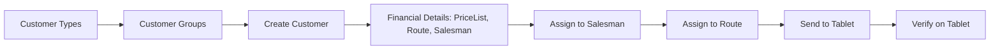

# Customer Setup Workflow

## Overview
Complete process from defining customer types and groups through creating the customer record, assigning financial settings, linking to a salesman and route, to appearing on the tablet.

## Step-by-Step

### Phase 1: Classification Definitions (Back Office)
1. **[[CustomersTypes]]** — Define categories (Wholesale, Hypermarket, Cash, etc.). Shown on tablet to help salesman identify the customer type.
2. **[[CustomersGroups]]** — Define base groups (not to be confused with promotion groups). Used for price-list-level segmentation.
3. **[[CustomersClasses]]** — Internal classification (e.g., "VIP") — visible only in BO, not on tablet.
4. **`CustomersPromotionGroups`** — Define promotion-target groups for later promotion assignment.

### Phase 2: Create Customer (Back Office)
5. **[[Customers]]** — Create main record:
   - Name, Foreign Name, Short Name
   - Location (city/area)
   - Customer Group, Customer Type
   - Reference1 (typically ERP customer ID from integration)
   - User ID (BO user who owns this customer)
   
6. **`CustomersLocations`** — Add location with GPS coordinates (longitude/latitude). Can be:
   - Entered manually in BO
   - Collected by salesman via [[Pro_CollectGPS]] on tablet
   - Approved/rejected in [[Pro_CustomerLocationApproval]]

### Phase 3: Financial Setup (Back Office)
7. **[[CustomersFinancialDetails]]** — Configure:
   - **Salesperson Position** — who visits this customer
   - **[[PriceLists]]** — which price tier applies
   - **`Routes`** — which route includes this customer
   - Payment Type, Check Due Days, Due Days
   - Invoice Type (Cash/Credit)
   - Credit Limit, Check Limit
   - Business Unit, Company Branch
   - ⚠️ This is the core link table connecting customer ↔ salesman ↔ price ↔ route

### Phase 4: Assignment & Approvals
8. **[[Pro_AssignCustomersForSalesman]]** — Link customer to salesman. Without this, customer is invisible on tablet.
9. **[[Pro_CustomersRoutesAssignment]]** — Add customer to a route (after route exists — see [[Route-Planning]]).
10. **[[Pro_PriceListPromotionGroupLink]]** — Optional: bulk-assign price list + promotion group to all customers of a given salesman.
11. **[[Pro_ApproveNewCustomers]]** — If customer was added by salesman from tablet, review details, location, images → approve or reject. Can require second approval.
12. **[[Pro_ApproveSalespersonsImages]]** — Approve/reject photos taken by salesman.

### Phase 5: Additional Configuration
13. **`CustomersSalesTargets`** — Set monthly/annual sales targets per customer (by item or by amount).
14. **`Planogram` + [[Pro_AssignPlanogramForCustomers]]** — Upload and assign shelf-plan diagrams.
15. **`CustomersItemAssignment`** — Restrict which items this customer can order (only items assigned here appear on tablet for this customer).
16. **[[Drawers]]** — Authorized check issuers for this customer.

### Phase 6: Sync to Tablet
17. **[[OT_SendSalesmanData]]** — Send updated customer data to tablet. Salesman must run "Data Update" on the tablet.

## Key Business Rules
- Bigger entities defined before smaller: Customer Groups → Customers, Categories → Items
- A customer without [[CustomersFinancialDetails]] record cannot transact
- Credit Limit is enforced on tablet: salesman cannot exceed it
- Reference1 is typically the ERP system's customer ID (integration bridge)

## Common Issues
- **Customer not showing on tablet** → missing [[Pro_AssignCustomersForSalesman]] or route assignment incomplete
- **Wrong price on tablet** → [[CustomersFinancialDetails]].PriceListID points to incorrect price list
- **Can't create invoice (credit limit)** → customer exceeded [[CustomersFinancialDetails]].CreditLimit
- **GPS not saving** → location approval pending in [[Pro_CustomerLocationApproval]]
- **New customer from tablet missing** → pending approval in [[Pro_ApproveNewCustomers]]

## Related Workflows
- [[Salesman-Onboarding]]
- [[PriceList-Management]]
- [[Route-Planning]]
- [[Data-Sync-Cycle]]
