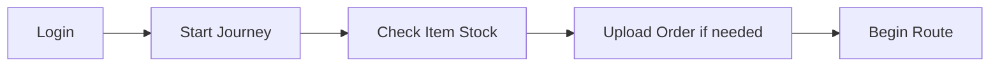
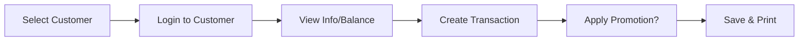
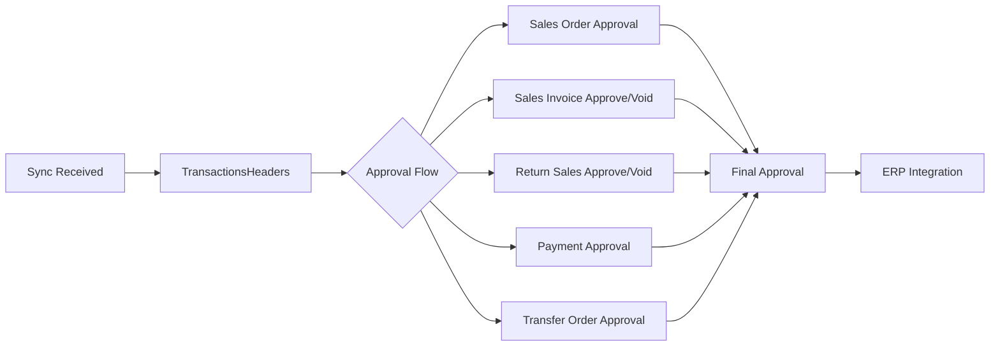

# Daily Sales Cycle (Order-to-Cash)

## Overview
The complete daily routine of a field salesperson: start journey, visit customers, conduct transactions, return to base, sync data, back-office approval, and ERP transfer.

## Step-by-Step

### Phase 1: Start Day (Tablet)

1. Salesman opens OSFA app → enters credentials
2. **Start Journey** prompt appears: "Would you like to start journey?" → Yes
3. **`ItemStock`** → check van inventory
4. **`UploadOrder`** — If van needs restocking: select store → pick items → set quantities → save → prints upload order. This is a **Load/Transfer Order**: items move from warehouse to van
5. Navigate to first customer following route order

### Phase 2: Customer Visit (Tablet)

6. **`ViewCustomers`** → select customer from list (sorted by route order)
   - Color coding: Green ✓ = visited successfully, Green ✗ = visited no sale, Yellow = due, Red = suspended
7. **Login to Customer** — GPS may be enforced; generate override password via [[Pro_PasswordGenerator]] if needed
8. **`ViewCustomerInformation`** — review credit limit, balance, last transactions
9. **Choose transaction type:**

| Transaction | Table Prefix | Description |
|---|---|---|
| Sales Order | [[OT_OrderHF]]/[[OT_OrderDF]] | Non-cash order for future delivery |
| Sales Invoice | [[OT_InvoiceHF]]/[[OT_InvoiceDF]] | Immediate cash/credit sale |
| Return Sales | `OT_ReturnSalesHF`/`OT_ReturnSalesDF` | Customer returns goods |
| Return Order | [[OT_ReturnOrderHF]]/[[OT_ReturnOrderDF]] | Return unfulfilled order |
| Payment | `OT_PaymentHF`/`OT_PaymentDF` | Cash/check collection |
| Stock Taking | `OT_CustomerStockTakingHF`/`OT_CustomerStockTakingDF` | Count customer inventory |
| Sales Quotation | [[OT_SalesQuotationHF]]/[[OT_SalesQuotationDF]] | Price quote |

10. **Build transaction**: select category → select items → enter quantities → preview → apply promotions (yellow popup) → save → print receipt

### Phase 3: End of Day (Tablet)
11. **`UnloadOrder`** — Return unsold items from van to warehouse (optional: "include all items" for quick unload)
12. **`DataUpdates`** — Run full sync:
    - Options: Update Images, Upload Only, Upload Action Log
    - Best practice: select all three
    - Progress bar → 100% = ✓ green check marks
    - ⚠️ Red crosses = some items failed check server connection or retry

### Phase 4: Back Office Approval

13. Transactions land in BO [[TransactionsHeaders]]/[[TransactionsDetails]]
14. Sequential approvals per transaction type:
    - **[[Pro_SalesOrdersApproval]]** → approve → [[Pro_SalesOrderFinalApproval]] → ERP
    - **[[Pro_SalesInvoiceApproval]]** → approve → void option available
    - **[[Pro_ReturnSalesApproval]]** → approve → [[Pro_ReturnSalesFinalApproval]] → ERP
    - **[[Pro_PaymentsApproval]]** → approve → [[Pro_ApproveVoidPayments]]
    - **[[Pro_TransferOrdersApproval]]** → approve load/unload
15. **Line Manager Approval** (optional): additional approval layer for invoice/return
16. Approved transactions → IsPosted = true → transferred to ERP via integration

## Color Code Reference (Tablet)
| Color | Meaning |
|---|---|
| Green ✓ | Customer visited, transaction successful |
| Green ✗ | Customer visited, no sale |
| Yellow | Customer due for visit |
| Red | Customer is suspended |
| Yellow right panel | Customer has unpaid balance |

## Common Issues
- **Transaction not syncing** → tablet has pending data, server IP wrong, or sync data option not run
- **Approval stuck** → missing permission on BO user or ERP connection down
- **Wrong prices on invoice** → stale price list not updated; send data again
- **Credit limit exceeded at save** → customer reached [[CustomersFinancialDetails]].CreditLimit
- **Promotion not available** → not assigned to salesperson group or customer promotion group

## Related Workflows
- [[Data-Sync-Cycle]]
- [[Route-Planning]]
- [[Return-Reversal-Workflow]]
- [[Payments-and-Collections]]
