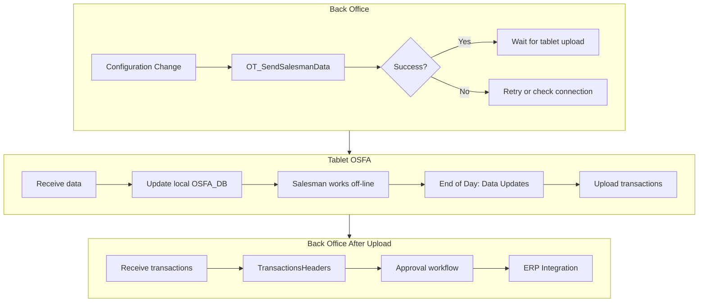

# Data Sync Cycle

## Overview
The bidirectional data flow between BO server (Olives_BO) and tablet (OSFA_DB). BO pushes master data *to* tablet; tablet pushes transactions *back* to BO.

## Direction: BO → Tablet (Send Data)

### What Gets Sent
| Category | Source Tables | Frequency |
|---|---|---|
| Customers & Routes | [[Customers]], [[CustomersFinancialDetails]], `Routes`, `RouteDetails` | Daily or on change |
| Items & Prices | [[Items]], [[PriceLists]], [[PriceListDetails]] | Daily or on change |
| Salesman Config | [[SalesPersonsDevicePermissions]], `SalespersonsItemsAssignment`, `SystemOptions` | On change |
| Promotions | `Promotions`, `PromotionsDetails` | On change |
| Surveys | `SurveyHeader`, `SurveyQuestions` | On change |

### Trigger
- BO user: **[[OT_SendSalesmanData]]** (menu: Salespersons → Send Data to Salesman)
- Select salesman(s) by checkbox → press Send
- Progress popup shows "Send data to #N salesman(s)"
- ⚠️ Always re-send after ANY configuration change

## Direction: Tablet → BO (Upload)

### What Gets Uploaded
| Category | Source Tables (OSFA_DB) | Destination (Olives_BO) |
|---|---|---|
| Sales Invoices | [[OT_InvoiceHF]], [[OT_InvoiceDF]] | [[TransactionsHeaders]], [[TransactionsDetails]] |
| Sales Orders | [[OT_OrderHF]], [[OT_OrderDF]] | [[TransactionsHeaders]], [[TransactionsDetails]] |
| Return Sales | `OT_ReturnSalesHF`, `OT_ReturnSalesDF` | `ReturnSalesHeaders`, `ReturnSalesDetails` |
| Return Orders | [[OT_ReturnOrderHF]], [[OT_ReturnOrderDF]] | [[ReturnOrdersHeaders]], [[ReturnOrdersDetails]] |
| Payments | `OT_PaymentHF`, `OT_PaymentDF` | `PaymentsHeaders`, `PaymentsDetails` |
| Stock Taking | `OT_CustomerStockTakingHF`, `OT_CustomerStockTakingDF` | `CustomerStockTakingHeaders`, `StockTakingDetails` |
| Surveys | `OT_SurveyHF`, `OT_SurveyDF` | `SurveyHeaders`, `SurveyDetails` |

### Trigger (Tablet)
- Salesman: **Data Updates** icon → select options:
  - **Update Images**: sync photos
  - **Upload Only**: send transactions only
  - **Upload Action Log**: send GPS/log data
  - Best practice: select all three → tap **Update Data**
- Progress bar: 0% → 100%
- ✓ = success, ✗ = failure (check server connection)

## Full Sync Lifecycle

## Integration with ERP
- External ERP systems (SAP, AX, GP, etc.) connect via [[ABS_Integration_Jebrene]], [[SAP_Naouri_Integ]], [[GP_Integ_Zumot]], etc.
- Approved transactions marked `IsPosted = true` → sent to ERP
- ERP updates master data (items, prices, customers) → pulled back into BO → sent to tablet

## Error Handling
| Issue | Cause | Fix |
|---|---|---|
| Sync stuck at 0% | Server IP wrong or firewall | Check `DeviceInformation` and server config |
| Red cross on item import | Item code mismatch between BO and ERP | Verify integration mapping |
| Red cross on price list | Price list suspended or missing | Check [[PriceLists]].IsSuspended |
| Transaction not uploading | Tablet storage full or corrupted data | Clear tablet cache, retry |
| Partial upload (some ✓, some ✗) | Network interruption during sync | Run Data Updates again |

## Steps
The sync cycle runs as a repeating loop between BO, tablet, and ERP:

1. **Configure & send (BO → Tablet)** — After any config change, BO user runs [[OT_SendSalesmanData]] to push master data (`Customers`, `Items`, `PriceLists`, `SalesPersons`, `SystemOptions`) to the tablet.
2. **Receive & store (Tablet)** — Tablet receives data and updates local OSFA_DB; salesman works offline.
3. **Upload transactions (Tablet → BO)** — End of day, salesman uses **Data Updates** → selects Update Images / Upload Only / Upload Action Log → taps **Update Data**; `OT_InvoiceHF`/`OT_OrderHF`/etc. upload to `TransactionsHeaders`.
4. **Import & map (BO)** — BO runs [[Pro_ImportData]] / [[Pro_MapTransactionLog]] (`OT_UploadTransactions`, `OT_UpdateData`) to import uploaded transactions.
5. **Approve & post** — Transactions enter approval workflow; approved rows marked `IsPosted = true`.
6. **ERP sync** — Posted transactions sent to ERP; ERP updates master data → pulled back into BO → pushed to tablet on next [[OT_SendSalesmanData]].

## Common Issues
- **Sync stuck at 0%** — check tablet connectivity and server IP/firewall; verify `DeviceInformation` and `OT_SyncLog`.
- **Upload failures (✗)** — network interruption or tablet storage full; re-run Data Updates and check `OT_SendDataLog`.
- **Conflicts / duplicate data** — sync uses last-write-wins; verify resolved records in BO (`TransactionsHeaders`, `SalesPersons`).

## Related Workflows
- [[Daily-Sales-Cycle]]
- [[Salesman-Onboarding]]
- [[Inventory-Management]]
<!-- Bidirectional link anchor -->
