# Inventory Management Workflow

## Overview
Manage van inventory: load stock from warehouse, unload returns, count stock, and reconcile. Two independent inventory flows — salesman van stock and customer stock.

## Flow 1: Load Order (Van Stocking)

### Tablet Side
1. Salesman opens **`UploadOrder`** icon
2. Select store (warehouse source)
3. Browse categories → tap items → enter quantity
4. Items appear under "Items" list
5. Save → prints upload order

### BO Side
6. `UploadOrdersHeaders`/`UploadOrdersDetails` → synced from tablet
7. **[[Pro_TransferOrdersApproval]]** → approve or reject load
8. Approved → inventory moves to salesman's van (theoretical stock)

## Flow 2: Unload Order (Van Returns)

### Tablet Side
1. Salesman opens **`UnloadOrder`** icon
2. Popup: "Include all van items?":
   - **Yes** → auto-populates with all van stock (quick)
   - **No** → select items manually
3. Select destination store
4. Save → prints unload order

### BO Side
5. `UnloadOrdersHeaders`/`UnloadOrdersDetails` → synced from tablet
6. **[[Pro_TransferOrdersApproval]]** → approve or reject unload
7. Approved → inventory returns to warehouse

## Flow 3: Stock Taking

### Salesman Van Stock
1. Salesman counts van inventory → creates stock-taking transaction
2. **[[Pro_SalespersonStockTakingApproval]]** → BO approves count
3. Used for reconciliation vs theoretical van stock

### Customer Stock
1. Salesman logs into customer → **Stock Taking** icon
2. Choose: Shelf Stock or Warehouse Stock
3. Count items → enter quantities → save
4. `CustomerStockTakingHeaders` → synced → viewable in BO

## Flow 4: Van Custody Limits
- `VanCustody` — set min/max quantities per item per salesman
- When active: system prevents uploading above max, auto-calculates required qty for upload
- ⚠️ Requires additional coding/customization by CDS

```mermaid
flowchart TD
    subgraph Load[LOAD]
        A1[Upload Order on tablet] --> B1[BO Approval]
        B1 --> C1[Van stock increased]
    end

    subgraph Unload[UNLOAD]
        A2[Unload Order on tablet] --> B2[BO Approval]
        B2 --> C2[Warehouse stock increased]
    end

    subgraph Count[STOCK TAKE]
        A3[Salesman counts van] --> B3[Stock Taking on tablet]
        B3 --> C3[BO Approval]
    end

    subgraph Customer[Customer Stock]
        A4[Salesman at customer] --> B4[Stock Taking transaction]
        B4 --> C4[Sync to BO]
    end
```

## Auto Unload
- **[[Pro_SalesmanAutoUnload]]** — one-click unload all van items for cash van salesmen
- Select salesman → press "Unload Quantity" → all van stock returned
- Must send data update to salesman after

## Common Issues
- **Load order rejected** → item quantities exceed `VanCustody` limits
- **Van stock mismatch** → salesman didn't unload before end of day
- **Stock count not approved** → [[Pro_SalespersonStockTakingApproval]] pending
- **Auto unload not working** → not configured for that salesman type
- **Quantity discrepancy** → unload not synced to BO before next load

## Steps
High-level inventory management process (details in the Flow sections below):

1. **Load stock to van** — salesman creates an Upload Order on tablet ([[#Flow 1: Load Order (Van Stocking)]]); BO approves via [[Pro_TransferOrdersApproval]].
2. **Unload returns to warehouse** — salesman creates an Unload Order on tablet ([[#Flow 2: Unload Order (Van Returns)]]); BO approves via [[Pro_TransferOrdersApproval]].
3. **Take stock** — van stock count and customer stock count ([[#Flow 3: Stock Taking]]) approved via [[Pro_SalespersonStockTakingApproval]].
4. **Enforce custody limits** — `VanCustody` min/max per item per salesman governs uploads ([[#Flow 4: Van Custody Limits]]).
5. **Auto unload (optional)** — one-click return of all van stock via [[Pro_SalesmanAutoUnload]], then send data update to salesman.

## Related Workflows
- [[Daily-Sales-Cycle]]
- [[Data-Sync-Cycle]]
- [[Salesman-Onboarding]]
