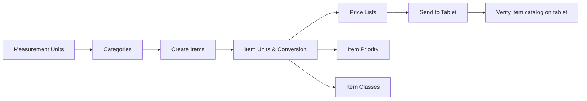

# Items Master Data Setup Workflow

## Overview
Define all products sold through the system: item codes, names, categories, units of measure, pricing, catalog media, and classification. All inventory/transaction workflows depend on this foundation.

## Step-by-Step

### Phase 1: Classification Structure
1. **`MeasurementUnits`** — Define units of measure (Carton, Piece, Box, Kg, etc.)
2. **`Categories`** — Define category hierarchy (Category → Sub-category):
   - Category Code + Name + Foreign Name + Short Name
   - Drives the item browsing tree on the tablet
3. **`ItemClasses`** — Optional classification for reporting (e.g., "Fast Moving", "High Margin")
4. **[[ItemsGroupBonusTarget]]** — Group items for bonus target purposes
5. **`ItemsSuggestedGroup`** — Group items that appear by default in suggested invoice/order

### Phase 2: Define Items
6. **[[Items]]** — Create item master record:
   - **Mandatory fields**: Item Code, Name, Unit, Category Code
   - Optional: Foreign Name, Barcode, Weight
   - Reference fields for ERP integration
   - ⚠️ Without these, sending data to tablet will fail

7. **[[ItemsUnits]]** — Define item-specific unit conversions:
   - Biggest unit = base (convert_rate = 1 for base unit)
   - Sub-units: convert_rate defines how many sub-units = 1 base unit
   - Example: 1 Carton (base) = 10 Pieces (sub-unit, convert_rate = 10)
   - Also: barcode, weight per unit

### Phase 3: Pricing
8. **[[PriceLists]]** + **[[PriceListDetails]]** — Create price lists and populate item prices
   - See [[PriceList-Management]] for full workflow

### Phase 4: Additional Configuration
9. **`ItemPriority`** — Set priority items to appear at top of item list (green color on tablet), optionally with suggested qty per customer type
10. **`ItemReplacementGroups`** — Define interchangeable items (same price)
11. **`TargetReference`** — Define target reference names for linking to sales targets
12. **[[Pro_SortItems]]** — Drag-and-drop ordering within categories
13. **[[Pro_AssignItemsForStores]]** — Link items to specific stores

### Phase 5: Catalog Media (Optional)
14. **`ItemsCatalogMedia`** — Upload images/PDFs/videos for items:
    - One-by-one via Upload Catalog Media → Link Catalog Media
    - Bulk via Upload Catalog Multimedia with Item Link (filename = item code)
15. **[[Pro_AssignItemForReturn]]** — Mark items as returnable

## Common Issues
- **Item not in category on tablet** → item code not assigned to category or send-data not run
- **Wrong unit price** → [[ItemsUnits]] convert_rate incorrect
- **Can't find item for transaction** → not assigned to salesman via `SalespersonsItemsAssignment`
- **Barcode not scanning** → barcode field empty or duplicate
- **Catalog media not showing** → media file name doesn't match item code (for bulk upload)

## Related Workflows
- [[PriceList-Management]]
- [[Salesman-Onboarding]]
- [[Inventory-Management]]
- [[Promotion-Setup]]
