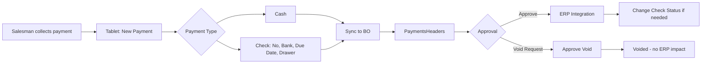

# Payments & Collections Workflow

## Overview
Collect cash and checks from customers, process receipts, manage check statuses, handle voids, and reconcile with ERP.

## Step-by-Step

### Phase 1: Salesman Collects Payment (Tablet)
1. Salesman logs into customer → taps **New Payment** icon
2. Select Document Type
3. Enter total payment amount
4. Split between:
   - **Cash**: entered by default when check is not specified
   - **Check**: enter check No., bank, due date, drawer name
   - ⚠️ Total of cash + checks must equal Payment Amount
5. **Pay Invoice option** (if payment covers specific invoice):
   - Auto Pay: enters amount → oldest invoice is covered
   - Manual: select specific invoice → enter partial payment
6. Save → print receipt

### Phase 2: BO Sync & Approval
7. `PaymentsHeaders`/`PaymentsDetails` → populated from tablet sync
8. **[[Pro_PaymentsApproval]]** → select payments → Approve (marks for ERP transfer)
9. **[[Pro_ApproveVoidPayments]]** → first request void → then approve void

### Phase 3: Check Management
10. **[[Pro_ChangeCheckStatus]]** — After sync, update check status:
    | Status | Meaning |
    |---|---|
    | No Status | Neither paid nor returned |
    | Return Check | Check bounced |
    | Converted to Legal | Legal action initiated |

### Phase 4: Special Operations
11. **[[Pro_ReceiptRequest]]** — Issue receipt request for upcoming collections
12. **[[Pro_ReceiptRequestSchedule]]** — Prioritize receipt requests by scheduling
13. **[[Pro_ImportOrdersIssues]]** — Bulk-upload payment orders from Excel template

### Phase 5: Reconciliation
14. **[[Pro_PaymentAmountDetails]]** — Review all payment details for auditing
15. **`CollectionsTarget`** — Track against `SalespersonsCollectionTarget`

## Key Business Rules
- Cash + Check(s) must = Payment Amount (system enforces)
- Auto Invoice Pay: oldest invoice first
- Check limit enforced per [[CustomersFinancialDetails]].CheckLimit
- Collections only tracked by amount (not by item — unlike sales targets)

## Common Issues
- **Payment not appearing in BO** → tablet sync pending; run `DataUpdates`
- **Wrong invoice covered** → manual pay must specify invoice; auto-pay may cover wrong one
- **Check bounced → no ERP update** → [[Pro_ChangeCheckStatus]] must be updated manually
- **Void request not processing** → payment already posted to ERP; must reverse there
- **Credit limit exceeded after payment** → payment not yet posted to customer balance

## Related Workflows
- [[Daily-Sales-Cycle]]
- [[Return-Reversal-Workflow]]
- [[Targets-and-Performance]]
