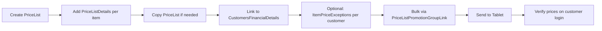

# Price List Management Workflow

## Overview
Create and assign price tiers (trade, wholesale, retail) to customers. Price lists define item-unit prices and are linked to customers via their financial details.

## Step-by-Step

### Phase 1: Create Price List
1. **[[PriceLists]]** — Create price list header:
   - Name (e.g., "Wholesale 2025", "Retail Cash")
   - Currency ID
   - Start Date / End Date
   - Notes, Reference1, Reference2
   - `IsSuspended` — deactivate without deleting

### Phase 2: Populate Prices
2. **[[PriceListDetails]]** — For each item in the price list:
   - Item Code, Item Unit
   - Unit Price
   - Tax Type, Tax Percent
   - Discount Percent
   - Shelf Price (optional)
   - ⚠️ Bigger unit = base for conversion (convert_rate defines sub-unit pricing)

3. **[[Pro_CopyPricelist]]** — Create new price list by copying an existing one (saves time when creating seasonal or regional variants).

### Phase 3: Link to Customers
4. **`ItemPriceExceptions`** — Set per-customer special prices (overrides standard price list for specific customers).

5. **Assign via [[CustomersFinancialDetails]]**:
   - Set `PriceListID` to the correct price list per customer
   - Best practice: assign before salesman goes to field

6. **Bulk via [[Pro_PriceListPromotionGroupLink]]**:
   - Select Price List + Promotion Group + Customer Range + Salesman
   - Updates all linked customers' price lists in one operation
   - ⚠️ Only effective if customers are NOT ERP-integrated (otherwise ERP overwrites)

### Phase 4: Sync & Verify
7. **[[OT_SendSalesmanData]]** — Push updated prices to tablet. Salesman runs Data Update.
8. **Verify**: Salesman logs into customer → check item prices match expected price list.

## Key Business Rules
- Different customers can have different price lists for same items
- Price lists can be time-bound (StartDate/EndDate) for seasonal pricing
- Item Price Exceptions > Price List standard prices (override hierarchy)
- Price list with `IsSuspended` = true is ignored during sync

## Common Issues
- **Wrong price on tablet** → [[CustomersFinancialDetails]].PriceListID incorrect or price list suspended
- **Price list not syncing** → not included in send-data package or salesman didn't run update
- **Copy price list missing items** → source price list has unpopulated details
- **ERP overwriting prices** → integration overwrites BO-set price lists; check ERP integration config

## Related Workflows
- [[Customer-Setup]]
- [[Salesman-Onboarding]]
- [[Data-Sync-Cycle]]
- [[Promotion-Setup]]
