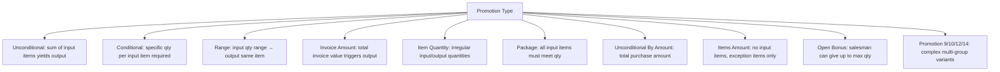

# Promotion Setup Workflow

## Overview
Olives supports 15 promotion types. This workflow covers the common pattern for creating any promotion type, assigning it to salesman groups and customer groups, and activating it on the tablet.

## Step-by-Step

### Phase 1: Foundation
1. **`PromotionsClasses`** — Define classification (e.g., "Supermarket Promotions", "Ramadan Promo"). Optional but useful for filtering.
2. **[[PromotionsPriorities]]** — Define priority levels. Priority determines which promotion applies first if multiple are eligible.

### Phase 2: Choose Promotion Type

**Type selection guide:**
| Type | Use Case | Config Complexity |
|------|----------|-------------------|
| Unconditional | "Buy any 10 items, get 1 free" | Low |
| Conditional | "Buy 5 of item X AND 3 of item Y → get Z" | Medium |
| Range | "Buy 10-20 cartons of X → get 1 free" | Low |
| Invoice Amount | "Spend 500+ → get 10% discount" | Low |
| Package | "Buy 2 of X + 3 of Y + 1 of Z as a bundle" | High |
| Open Bonus | "Salesman can give up to 5 free items of X" | Low |

### Phase 3: Configure Promotion Header
3. Create promotion of chosen type:
   - Name, Promotion Details
   - Start Date / End Date (must be valid)
   - Input quantity/amount
   - Output type: **Discount** (percent/amount) or **Quantity** (free items)
   - Round type: Down / Up / Standard
   - Invoice type: All / Credit / Cash / Check
   - ⚠️ `Use In Sales` must be checked to activate
   - Optional: `Use In Return`, `Apply For All Units`, `Not Double`, `Is Suspended`

### Phase 4: Assign Scope
4. **[[SalesPersonsGroups]]** — Assign promotion to one or more salesman groups (via sub-tab).
5. **`CustomersPromotionGroups`** — Assign promotion to customer promotion groups (via sub-tab). These are **separate** from regular customer groups.
6. **Input Items** — Select input items and quantities.
7. **Output Items** — Select output items (if output type = Quantity).

### Phase 5: Set Priority
8. **`PromotionsPrioritiesSort`** — Arrange priority order. Useful when a customer qualifies for multiple promotions. The highest-priority promotion applies first.

### Phase 6: Activate & Sync
9. **[[Pro_PromotionsApproval]]** — If WF approval is enabled, promotions require supervisor approval before activation.
10. **[[Pro_PromotionsWFApprove]]** — Configure which employees approve promotion override requests from salesmen.
11. **[[OT_SendSalesmanData]]** — Push promotions to tablet.
12. **Test**: Salesman logs into assigned customer → transaction triggers promotion → verify correct output.

## Promotion-Specific Notes
| Promotion Type | Key Constraint |
|---|---|
| Range | Input item MUST = output item (same item) |
| Package | All input items must reach their qty threshold |
| Unconditional By Amount | Total amount matters, not per-item qty |
| Promotion 12 | Output = groups with discount rate per group |
| Promotion 14 | Output groups have quantity ranges (from-to) |

## Common Issues
- **Promotion not applying** → `Use In Sales` unchecked, dates invalid, or target group not assigned
- **Wrong discount amount** → round type (Down/Up/Standard) producing unexpected fraction handling
- **Promotion not on tablet** → salesman not in assigned group or customer not in promotion group
- **Salesman can't apply promotion → WF approval pending** → check [[Pro_PromotionsWFApprove]] config
- **Bonus target exceeded** → check `SalespersonsItemBonusTarget` limits

## Related Workflows
- [[Salesman-Onboarding]]
- [[Customer-Setup]]
- [[PriceList-Management]]
- [[Data-Sync-Cycle]]
