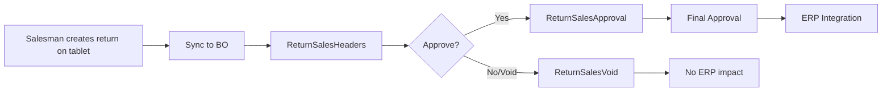

# Return / Reversal Workflow

## Overview
Process for returning goods from a customer (return sales), canceling an unfulfilled order (return order/back order), and voiding incorrect transactions.

## Transaction Types

| Type | What It Does | Tablet Entry | BO Approval |
|---|---|---|---|
| **Return Sales** | Customer returns previously invoiced goods | `OT_ReturnSalesHF`/`OT_ReturnSalesDF` | [[Pro_ReturnSalesApproval]] → Final → ERP |
| **Return Order** | Cancel an open sales order before fulfillment | [[OT_ReturnOrderHF]]/[[OT_ReturnOrderDF]] | [[Pro_ReturnOrdersApproval]] → Final → ERP |
| **Back Order** | Reverse/undo a completed sales order | `BackOrder` | [[Pro_BackOrder]] → [[Pro_SendBackOrder]] |
| **Sales Invoice Void** | Mark invoice as void (no accounting impact) | N/A (BO only) | [[Pro_SalesInvoiceVoid]] |

## Step-by-Step: Return Sales

### Tablet Side
1. Salesman logs into customer → taps **New Return Sales** icon
2. Select item categories → tap items → enter return quantity
3. Set item status: **Damaged** / **Valid** (for disposition tracking)
4. Select invoice type: Credit / Cash
5. Tap save → print receipt

### Back Office Side
6. `ReturnSalesHeaders` → sync from tablet
7. **[[Pro_ReturnSalesApproval]]** → select return → approve or reject
8. **[[Pro_ReturnSalesFinalApproval]]** (if multi-approval enabled) → final approve
9. Approved → transferred to ERP system
10. **Void option**: [[Pro_ReturnSalesVoid]] → mark as void (prevent ERP transfer)

## Step-by-Step: Sales Order Back Order
1. BO user opens `BackOrder` record
2. Select order → press Order Quantity to view items
3. Enter reversal quantities
4. Approve via [[Pro_BackOrder]]
5. Submit via [[Pro_SendBackOrder]]

## Common Issues
- **Return not found in BO** → tablet sync pending; check `DataUpdates` status
- **Cannot return invoiced items** → item already transferred to ERP; use credit note process
- **Wrong quantities** → salesman entered wrong return quantity; BO can edit before approval
- **Back order stuck** → order already partially fulfilled; reversal limited to remaining qty
- **Void not taking effect** → invoice already posted to ERP; must reverse in ERP

## Related Workflows
- [[Daily-Sales-Cycle]]
- [[Payments-and-Collections]]
- [[Data-Sync-Cycle]]
