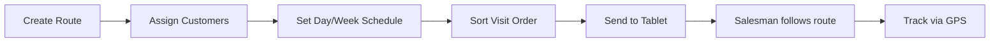

# Route Planning Workflow

## Overview
Define salesperson visitation routes — sequences of customer visits optimized for geography, day-of-week, and visit order. Routes reduce overlap, save fuel, and enable accurate tracking.

## Step-by-Step

### Phase 1: Create Route
1. **`Routes`** — Define route header: Name + Short Name (e.g., "Amman-North-1", "Zarqa-East").

### Phase 2: Assign Customers
2. **[[Pro_CustomersRoutesAssignment]]** — Add customers to the route:
   - Select Salesperson Position + Route
   - Move customers from Unassigned → Assigned
   - A customer can belong to only one route per salesman

### Phase 3: Schedule Visits
3. **`PositionsRoute`** — Set weekly visitation schedule:
   - For each day (Sun–Sat), set the week order (1, 2, 3, 4)
   - Week order is computed by the system (not simple calendar week — uses a universal equation accounting for month day counts)
   - The system shows the current real week order on the window

### Phase 4: Sort Visits
4. **`RouteSort`** — Drag customers into visit order:
   - First customer = first visit of the day
   - Drag up/down to reorder
   - Press Update to save

### Phase 5: Sync to Tablet
5. **[[OT_SendSalesmanData]]** — Push route data.
6. Salesman sees route on tablet → customer list shows route-based priority → GPS navigation guides each stop.

### Phase 6: Monitor (Ongoing)
7. **[[Pro_ShowRouteInMap]]** — View route on Google Maps.
8. **[[Pro_ShowMultiRouteInMap]]** — View 3 salesmen routes simultaneously.
9. **`SalespersonTracking`** — Track real-time salesman location along the route.

### Bulk Import (Alternative)
- **[[Pro_ImportRouteInfoFromExcel]]** — Download template → fill with all route data → upload in one shot. Useful for initial deployment with many routes.

## Additional Route Operations
| Operation | Purpose | Table/Proc |
|---|---|---|
| Additional Route | Cover for absent salesman | `SalespersonsAdditionalRoute` |
| Transfer Customers | Move customers between salesmen (by route) | [[Pro_TransferCustomersByRoute]] |
| Move Per Routes | Route-specific customer transfer | [[Pro_MoveSalespersonCustomersPerRoutes]] |

## Common Issues
- **Customers not appearing in route** → not assigned via [[Pro_CustomersRoutesAssignment]] or route not saved
- **Wrong visit order on tablet** → `RouteSort` not updated before send-data
- **Week order mismatch** → system-computed week order differs from business expectation; verify in `PositionsRoute`
- **Salesman visiting wrong customers** → route assignment changed mid-week without re-sync
- **GPS points not aligning to route** → customer GPS coordinates pending approval in [[Pro_CustomerLocationApproval]]

## Related Workflows
- [[Salesman-Onboarding]]
- [[Customer-Setup]]
- [[Data-Sync-Cycle]]
- [[Daily-Sales-Cycle]]
