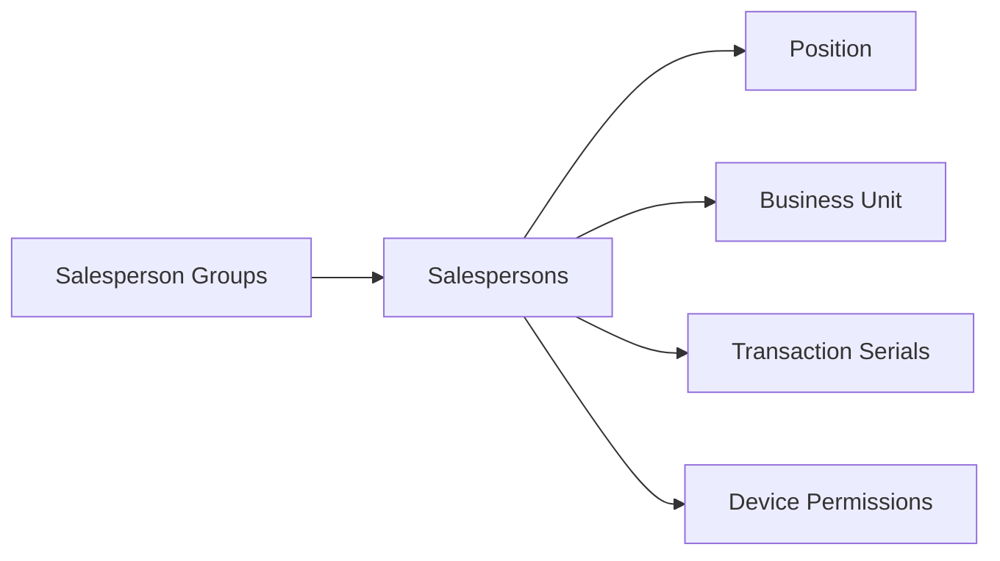
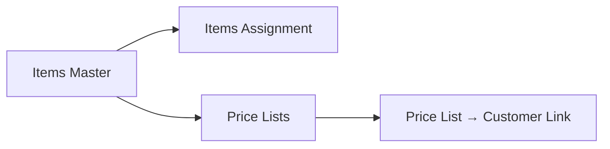
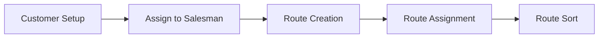
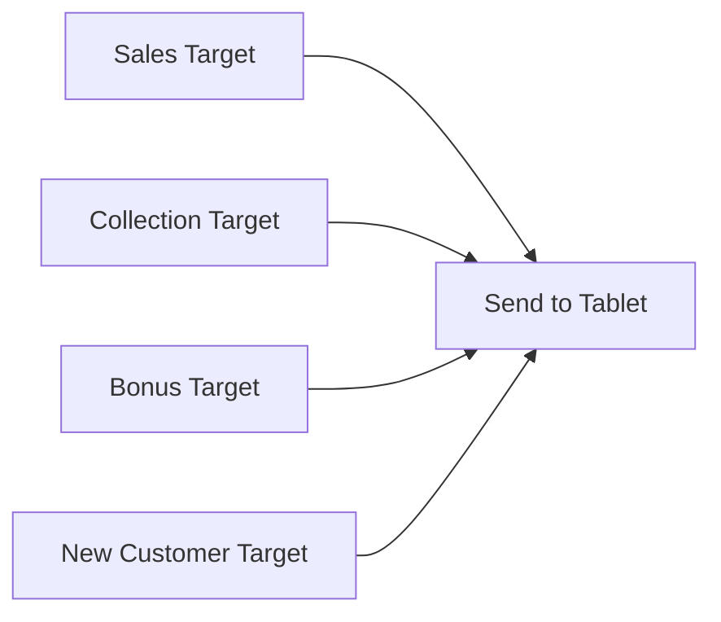

# Salesman Onboarding Workflow

## Overview
End-to-end process to create a new field salesperson, configure their permissions, assign inventory and customers, set routes, and push data to their tablet.

## Step-by-Step

### Phase 1: Foundation Setup (Back Office)

1. **[[SalesPersonsGroups]]** — Create or select a group (e.g., "Cash Van", "Order Taker", "Merchandiser"). Groups enable bulk assignment of permissions, promotions, and targets later.

2. **[[SalesPersons]]** — Create the main record with:
   - Name, Business Unit, Group ID, Salesperson Type (rank)
   - **[[Positions]]**: critical — position carries a "basket of privileges" so swapping a person (resignation) only requires changing the name, not reconfiguring all permissions
   - Supervisor assignment
   - Company Branch ID
   - Reference1/Reference2 (often stores ERP salesman code or van stock ID)
   - ⚠️ Ensure `IsSuspended` is unchecked, or the salesman cannot work

3. **`SalespersonsTransactionSerials`** — Assign unique 7-digit serial ranges per transaction type:
   - Convention: first digit matches position number → immediate visual identification
   - Different serials for Sales Invoice, Sales Order, Return Sales, etc.

4. **[[SalesPersonsDevicePermissions]]** — Configure tablet behavioral controls:
   - Cash-only vs credit-allowed
   - GPS-enforced login
   - Document type restrictions
   - Related: ~400 `SystemOptions` parameters (set via Settings → System Options)

### Phase 2: Inventory & Pricing (Back Office)

5. **`SalespersonsItemsAssignment`** — Assign which items the salesman can sell. Can copy to entire group via "Copy to Sales Person Group".

6. **`CustomerStockItemsAssignment`** — Assign items for customer stock-taking transactions (separate from sales items).

7. **`SalespersonsItemsSalesUnits`** — Restrict which unit of measure per item the salesman can transact in.

8. **[[PriceLists]]** — Ensure appropriate price lists exist. Assign customers to price lists via:
   - Option A: individual [[CustomersFinancialDetails]].PriceListID
   - Option B: bulk via [[Pro_PriceListPromotionGroupLink]] (assigns price list + promotion group to all customers of a salesman in one operation)

### Phase 3: Customers & Routes (Back Office)

9. **Assign Customers** → use [[Pro_AssignCustomersForSalesman]]. Customers will NOT appear on the tablet without this step.

10. **`Routes`** → create route → **`RouteDetails`** → assign customers to route → **`PositionsRoute`** → set day/week visitation schedule → **`RouteSort`** → order customer visits.

11. **`SalespersonsAdditionalRoute`** — optional: assign temporary extra routes (e.g., covering for absent colleague).

### Phase 4: Targets (Back Office, Optional)

12. `SalespersonsSalesTarget` — by item or by amount, monthly
13. `SalespersonsCollectionTarget` — by amount only
14. `SalespersonsItemBonusTarget` — per-item bonus limits
15. `SalespersonsNewCustomerTarget` — monthly new acquisition targets

### Phase 5: Push to Tablet

16. **[[OT_SendSalesmanData]]** — sends all configuration, customers, items, price lists, routes, permissions to the tablet.
17. Salesman opens OSFA app → **Admin Settings** → enters server IP, company No., salesman No. → **Update Data** → syncs everything.
18. **Verify**: salesman logs in, checks:
    - Customers appear in customer list
    - Items appear with correct prices
    - Routes show on map
    - Permissions enforced (e.g., cannot create credit invoice if cash-only)

## Dependencies
| Prerequisite | Why |
|---|---|
| [[Company-Setup]] | Company, Branches, Business Units must exist |
| [[Items-Master-Data-Setup]] | Items, Units, Categories must be defined |
| [[Customer-Setup]] | Customers must exist before assignment |
| [[PriceList-Management]] | Price lists must exist before customer link |

## Common Issues
- **Salesman can't log in** → check `IsSuspended`, device permissions, tablet MAC in `DeviceInformation`
- **No customers on tablet** → missing [[Pro_AssignCustomersForSalesman]] step
- **Wrong prices** → [[CustomersFinancialDetails]].PriceListID incorrect or price list not included in send-data
- **Transaction serial error** → missing `SalespersonsTransactionSerials` entry
- **GPS login failure** → [[SalesPersonsDevicePermissions]] requires GPS → generate override password via [[Pro_PasswordGenerator]]

## Related Workflows
- [[Customer-Setup]]
- [[PriceList-Management]]
- [[Route-Planning]]
- [[Data-Sync-Cycle]]
