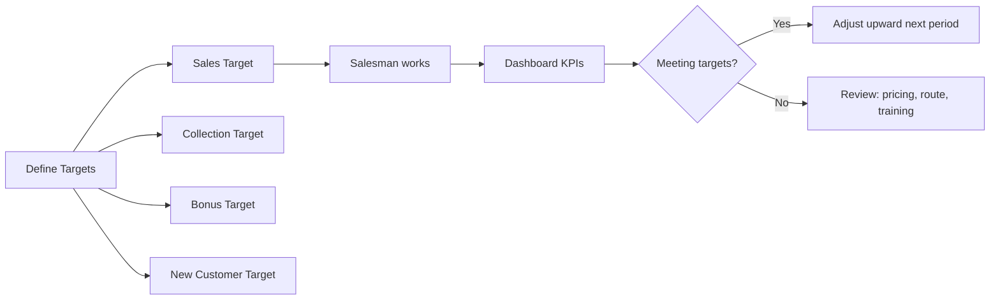

# Targets & Performance Management Workflow

## Overview
Define sales, collection, and bonus targets per salesman. Monitor performance through dashboards and reports. Adjust targets mid-period if needed.

## Step-by-Step: Setting Targets

### Sales Target
1. **`SalespersonsSalesTarget`** — per salesman:
   - **By Item**: select item → set monthly qty + amount
   - **By Amount**: set monthly monetary target → annual total calculated automatically
   - Enter year, select salesman (or group)

### Collection Target
2. **`SalespersonsCollectionTarget`** — per salesman (amount only, no by-item option):
   - Monthly collection amounts
   - ⚠️ Collection = cash/check collected, not sales made

### Bonus Target
3. **`SalespersonsItemBonusTarget`** — per-item bonus max qty:
   - Select salesman → year → item → monthly qty limit
   - Salesman cannot exceed this when giving free items via promotions

4. **`SalespersonsGroupItemBonusTarget`** — bonus for groups of items together
5. **`SalespersonsByItemsGroupBonus`** — combined: group bonus × salesperson group
   - ⚠️ Not all bonus features work simultaneously; choose best practice for your business

### New Customer Target
6. **`SalespersonsNewCustomerTarget`** — monthly acquisition target

### Customer-Level Targets
7. **`CustomersSalesTargets`** — per customer (by item or by amount)

### Distribution Item Target
8. **`DistributionItemTarget`** — assign item targets to specific salesperson/month

### Copy Tool
9. **[[Pro_CopyTarget]]** — copy sales, collection, or both from one salesman to others:
   - Source salesman + year + month(s)
   - Destination salesman (select by checkbox)
   - Press Copy

## Performance Monitoring

### Dashboards (BO)
| Dashboard | What It Shows | How To Use |
|---|---|---|
| [[Pro_DashboardSalesAnalysis]] | Route score, daily visits, verification, journey performance, route sales comparison | Select date → Refresh |
| [[Pro_DashboardSalesmanKPI]] | Gauge-based: sales vs target, collection vs target | Select salesman + month + year → Preview; navigate ← → for next salesman |
| [[Pro_DashboardSalesmanDashboard]] | Daily/monthly/custom period: general performance | Filter period → Preview |
| [[Pro_DashboardTargetDashboard]] | Sales achievement vs target by day or year | Select daily/monthly → date → Refresh → gauge display |
| [[Pro_DashboardSalesGrowth]] | Current period vs same period last year | Select period → Refresh; minus = decline, zero = same |
| [[Pro_DashboardProductPerformance]] | Product performance pie chart | Filter → Refresh |

### Reports
| Report | Content | Table/Proc |
|---|---|---|
| Route Summary by Salesman | Customer visits, times, payments, distance vs route | [[Rpt_RouteSummaryBySalesman]] |
| Total Cash Report | Cash/credit sales, collections, return values | `Rpt_CashTotal` |
| Item Sales Report | Sales by item or by category | `Rpt_ItemSales` |

## KPI Gauge Interpretation
- Upper value = actual performance
- Lower value = target
- Percentage shown = actual/target
- Example: Sales 5,000 / Target 10,000 = 50% gauge

## Common Issues
- **Target not reflecting in dashboard** → target not assigned to salesman or wrong year/month
- **Copied target missing records** → destination salesman had existing targets; overwrite conflicts
- **Bonus limit error on tablet** → `SalespersonsItemBonusTarget` exceeded; increase limit
- **Dashboard shows no data** → date range incorrect or no transactions in period
- **Sales growth negative** → correct; gauge shows comparative decline vs last year

## Related Workflows
- [[Salesman-Onboarding]]
- [[Daily-Sales-Cycle]]
- [[Promotion-Setup]]
