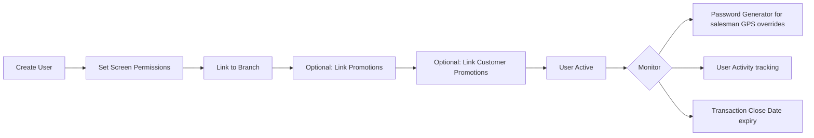

# Users & Permissions Workflow

## Overview
Create back-office users, assign granular screen-level permissions, link to branches and promotions. Controls who can access, add, edit, and delete in each system screen.

## Step-by-Step

### Phase 1: Create User
1. **[[Users]]** — Create user record:
   - Login Name, Password
   - Phone, Email
   - Transaction Close Date (auto-deactivation)
   - `IsSuspended` — block access without deleting
   - `All Promotions` — true = can edit all, false = restricted

### Phase 2: Set Permissions
2. **`UsersPermissions`** — Per-screen permissions:
   | Permission | Meaning |
   |---|---|
   | Can Access | User can view this screen |
   | Can Add | Can create new records |
   | Can Edit | Can modify existing records |
   | Can Delete | Can remove records |
   - Configured per tab/sub-tab across the entire system
   - ⚠️ Admin user should control other users' permissions

### Phase 3: Branch & Promotion Links
3. **`UserCompanyBranchLink`** — **Mandatory**: assign user to company branch. Without this, user sees only blank pages.
4. **`UserPromotionLink`** — Restrict which promotions the user can view/edit. Critical because promotions have financial impact.
5. **`UserCustomersPromotionsLink`** — Restrict which customer promotion groups the user can access.

### Phase 4: Operational Tools
6. **[[Pro_PasswordGenerator]]** — Generate one-time passwords for salesmen:
   - Use case: salesman cannot log into customer (GPS mismatch, service down)
   - Select salesman + customer → Generate → send password via call/SMS
   - Salesman enters password on tablet to override GPS login restriction

7. **[[UserActivity]]** — Monitor critical financial criteria per user:
   - Prevent credit limit changes
   - Prevent check allowance changes
   - Controlled by admin only

### Phase 5: User Activity Monitoring
8. **[[Pro_UserActivityLog]]** — Audit trail of user actions for security and compliance.

## Permission Levels
| Level | Access |
|---|---|
| Admin | Full system access, can create/edit users |
| Manager | Assigned screens + promotions |
| Viewer | Read-only on assigned screens |
| Restricted | Branch-specific + promotion-specific |

## Common Issues
- **User sees blank pages** → `UserCompanyBranchLink` not assigned
- **User can't edit records** → `UsersPermissions` missing Can Edit for that screen
- **Password generator not working** → admin permission or salesman/customer mismatch
- **User can't see promotions** → `UserPromotionLink` missing
- **User still active after termination** → Transaction Close Date not set or `IsSuspended` not checked
- **Forgot password** → admin resets via user edit screen

## Related Workflows
- [[Salesman-Onboarding]]
- [[Company-Setup]]
