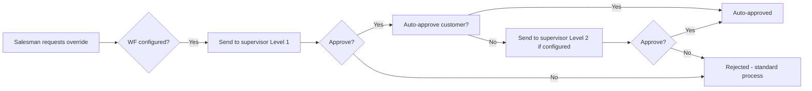

# Workflow Approval Setup

## Overview
Workflow (WF) is an optional feature enabling multi-level supervisor approval for salesman override requests. ~30+ overridable functions exist. Salesman submits → supervisor(s) approve/deny → salesman proceeds with exceeded action.

## Step-by-Step

### Phase 1: Configure Workflow
1. **[[WF_SetupHeader]] / [[WF_SetupDetails]]** — Define:
   - **Source**: WF from (trigger event)
   - **Function**: which overridable action (see Functions list below)
   - **Salesman Group**: which salesmen this WF applies to
   - **Level Count**: how many approval levels (1 = one approver, 2 = two, etc.)
   - **Level ID**: which position(s) approve at each level

### Phase 2: Overridable Functions (~30+)
| Function Category | Examples |
|---|---|
| Credit | Exceed credit limit, exceed check limit |
| Pricing | Apply exceptional discount, override price list |
| Timing | Login outside working hours, visit out-of-route |
| Inventory | Upload beyond van custody limit |
| Promotion | Apply promotion without meeting all conditions |

### Phase 3: Auto-Approve
2. **[[Pro_WFCustomersAutoApprove]]** — Override the WF for specific customers:
   - Select function → list of customers appears
   - Check = auto-approve (no supervisor needed for this customer)
   - Uncheck = standard WF (supervisor must approve)
   - Useful for trusted/regular customers

### Phase 4: Promotions WF
3. **[[Pro_PromotionsWFApprove]]** — Configure which employees approve promotion override requests from salesmen.
   - Select employee → assign promotions to their approval scope

### Phase 5: Monitoring
4. **[[Pro_WFFunctionsReport]]** — Generate PDF report:
   - Filter by date range + function + status (Approved/Rejected)
   - Use for auditing and performance review of approval process

## Common Issues
- **Workflow not triggering** → WF setup not configured for that function/salesman group
- **Wrong supervisor receiving request** → Level ID position assignment incorrect
- **Salesman can't get approval** → supervisor not logged in or no one assigned at that level
- **Auto-approve not working** → customer not added to [[Pro_WFCustomersAutoApprove]] list
- **Report empty** → no WF requests in selected date range or function

## Related Workflows
- [[Salesman-Onboarding]]
- [[Promotion-Setup]]
- [[Users-and-Permissions]]
