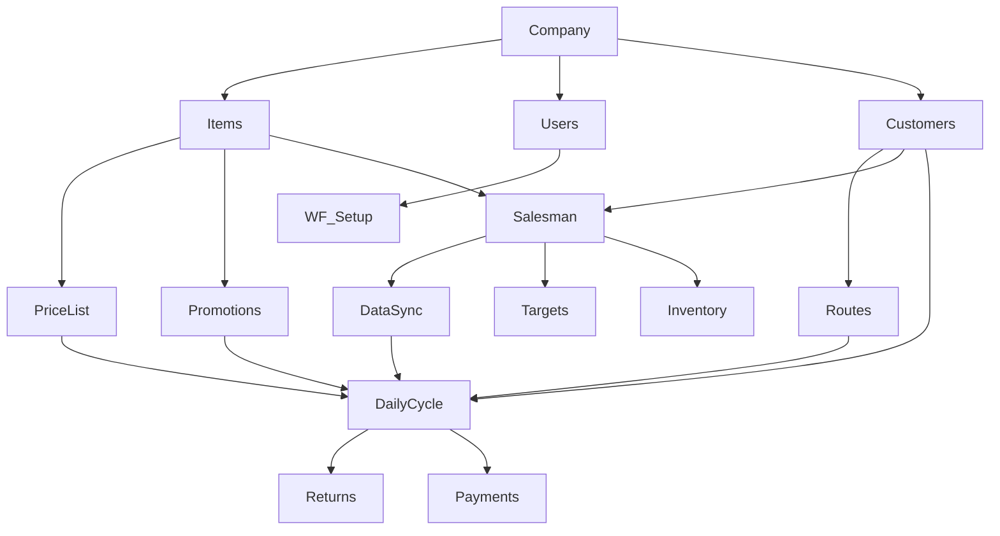

# Workflows — Map of Content

> Cross-domain business process notes bridging UI screens, database tables, and stored procedures. Each workflow describes an end-to-end process with ordered steps, business rules, table/procedure cross-refs, and troubleshooting guidance.

## Setup & Foundation

| Workflow | Prerequisites | Duration | Domain |
|---|---|---|---|
| [[Company-Setup]] | none | 2-4h | BO |
| [[Items-Master-Data-Setup]] | [[Company-Setup]] | 2-8h | BO |
| [[Users-and-Permissions]] | [[Company-Setup]] | 15-30min | BO |
| [[Workflow-Approval-Setup]] | [[Users-and-Permissions]] | 30-60min | BO |

## Sales & Customer Operations

| Workflow | Prerequisites | Duration | Domain |
|---|---|---|---|
| [[Salesman-Onboarding]] | [[Company-Setup]], [[Items-Master-Data-Setup]], [[Customer-Setup]] | 30-45min | Cross-DB |
| [[Customer-Setup]] | [[Company-Setup]], [[Items-Master-Data-Setup]] | 10-20min | Cross-DB |
| [[PriceList-Management]] | [[Items-Master-Data-Setup]] | 15-30min | BO |
| [[Promotion-Setup]] | [[Items-Master-Data-Setup]], [[Customer-Setup]] | 20-60min | Cross-DB |
| [[Route-Planning]] | [[Customer-Setup]], [[Salesman-Onboarding]] | 1-3h | BO |

## Daily Operations

| Workflow | Prerequisites | Duration | Domain |
|---|---|---|---|
| [[Daily-Sales-Cycle]] | [[Salesman-Onboarding]], [[Customer-Setup]], [[Data-Sync-Cycle]] | Full day | Cross-DB |
| [[Return-Reversal-Workflow]] | [[Daily-Sales-Cycle]] | 5-15min | Cross-DB |
| [[Payments-and-Collections]] | [[Daily-Sales-Cycle]] | 5-10min | Cross-DB |
| [[Inventory-Management]] | [[Items-Master-Data-Setup]], [[Salesman-Onboarding]] | 10-30min | Cross-DB |

## System Operations

| Workflow | Prerequisites | Duration | Domain |
|---|---|---|---|
| [[Data-Sync-Cycle]] | [[Salesman-Onboarding]] | 5-30min | Cross-DB |
| [[Targets-and-Performance]] | [[Salesman-Onboarding]] | 30-60min | BO |

## Dependency Graph



```dataview
TABLE
  domain AS Domain,
  estimated_duration AS Duration,
  prerequisites AS Prerequisites
FROM "Shared/Workflows"
WHERE type = "workflow"
SORT file.name
```
